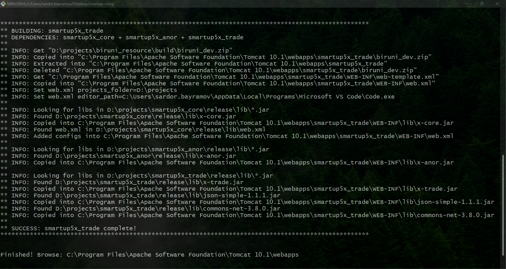

# Smartup Setup tool

This is a tool for setting up multiple tomcat applications in one click dedicated for Smartup projects.

#### What does it do?
1. It gets new biruni built bundle from specified path (`BIRUNI_PATH` in `.env` file).
2. Creates specified (`PROJECTS` in `.env` file) tomcat apps in `webapps/` folder using biruni bundle.
3. Configures web.xml as specified in each apps.
4. Provides each project's dependency libs (.jar files) into `lib/` folder.



## Prerequisites

Before you begin, ensure you have the following installed on your system:
- Node.js (12.x or higher)
- npm (6.x or higher)

## Installation

Follow these steps to set up the application on your local machine:

1. **Install Dependencies**

   Navigate to the project directory and clean-install the required npm packages:

   ```bash
   npm ci
   ```

2. **Configure Environment Variables**

   Duplicate the `sample.env` file and rename it to `.env`. Open the `.env` file and fill in the necessary data as per your setup:

   ```bash
   cp sample.env .env
   ```

3. **Starting the Setting up process**

   Once the configuration is set, you can start the setting up process by running:

   ```bash
   npm start
   ```
